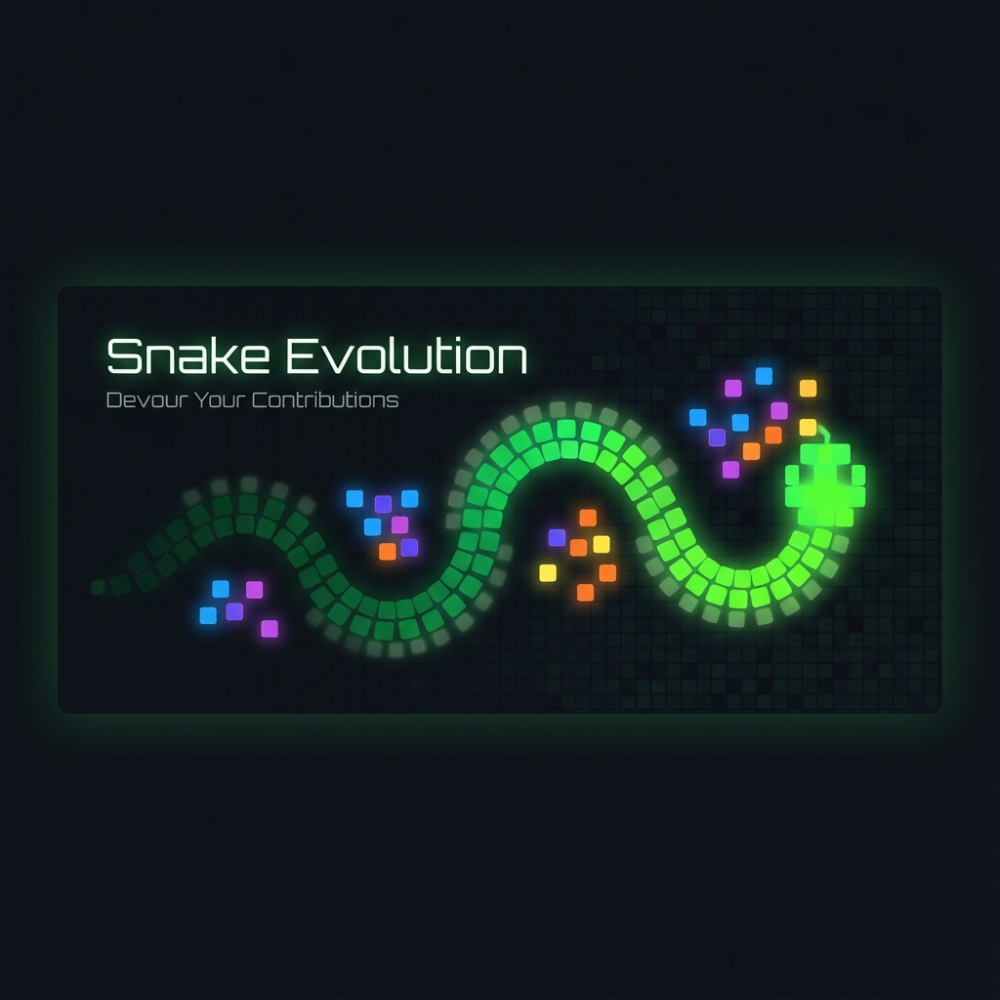

<p align="center">
  
</p>

# 🐍 Snake Evolution

> Transform your GitHub contribution graph into an epic snake animation that devours your contributions and grows longer!

[](https://github.com/miccy/snake-evolution/stargazers)
[](LICENSE)
[](CONTRIBUTING.md)

[🎮 Live Playground](#) | [📚 Documentation](#) | [🎨 Gallery](#) | [💬 Discord](#)

## ✨ What Makes This Different?

Unlike other GitHub snake generators, ours features:

- **🎮 Interactive Playground** - Try it instantly in your browser, no installation needed
- **🎨 10+ Visual Templates** - Neon Gamer, Minimal Pro, Matrix Hacker, and more
- **🐍 Growing Snake** - Gets longer as it devours contributions (just like the classic game!)
- **🌈 Full Customization** - Colors, growth rate, animation speed
- **💾 Local-First** - Uses Evolu for offline support and privacy
- **🎯 Share Instantly** - Auto-generated social media cards
- **🚀 Multiple Formats** - SVG, GIF, or live web component

## 🎬 See It In Action

<p align="center">
  <picture>
    <source media="(prefers-color-scheme: dark)" srcset="https://raw.githubusercontent.com/miccy/snake-evolution/output/snake.svg">
    <source media="(prefers-color-scheme: light)" srcset="https://raw.githubusercontent.com/miccy/snake-evolution/output/snake-light.svg">
    
  </picture>
</p>

## 🚀 Quick Start

### For GitHub Profile README

Add this to your `README.md`:

```markdown

```

Then set up the GitHub Action (see [GitHub Action Guide](#github-action))

### Try It Online

1. Visit [our playground](#)
2. Enter your GitHub username
3. Pick a template or customize colors
4. Download or share!

## 📦 What's Included

This monorepo contains:

### 🌐 Apps

- **[apps/web](./apps/web)** - Astro + React playground with Evolu database
- **[apps/docs](./apps/docs)** - Comprehensive documentation site (Astro Starlight)
- **[apps/action](./apps/action)** - GitHub Action for automated generation

### 📚 Packages

- **[packages/engine](./packages/engine)** - Core snake logic and pathfinding
- **[packages/renderer](./packages/renderer)** - SVG/GIF/Canvas rendering
- **[packages/github](./packages/github)** - GitHub API integration
- **[packages/cli](./packages/cli)** - Command-line tool

### 🔧 Tooling

- **[tooling/eslint-config](./tooling/eslint-config)** - Shared ESLint configuration
- **[tooling/typescript-config](./tooling/typescript-config)** - Shared TypeScript configs
- **[tooling/tailwind-config](./tooling/tailwind-config)** - Shared Tailwind configuration

## 🎨 Themes

| Theme | Description |
|-------|-------------|
| 🌑 `github-dark` | GitHub's dark mode (default) |
| ☀️ `github-light` | Classic GitHub light |
| 🌊 `ocean` | Cool blue tones |
| 🌅 `sunset` | Warm orange/pink gradient |
| 🎮 `neon-gamer` | Vibrant purple and green |
| 🪟 `glass` | iOS-style liquid glass effect |

## 🎮 Coming Soon: PvP Mode!

> **Challenge friends to snake battles!**

- 🏆 **Leaderboards** - Global rankings
- ⚔️ **1v1 Challenges** - Battle friends or colleagues  
- 👥 **Team Battles** - Company vs company (B2B)
- ⚡ **Power-ups** - Shrink, teleport, shield
- 📈 **Progressive difficulty** - Each round faster!

[View full roadmap →](./docs/ROADMAP.md)

## 🛠️ GitHub Action

Add to `.github/workflows/snake.yml`:

```yaml
name: Generate Snake

on:
  schedule:
    - cron: "0 0 * * *" # Daily at midnight
  workflow_dispatch:
  push:
    branches: [main]

jobs:
  generate:
    runs-on: ubuntu-latest
    permissions:
      contents: write
    
    steps:
      - uses: actions/checkout@v4
      
      - name: Generate Snake
        uses: miccy/snake-evolution@main
        with:
          github_user_name: ${{ github.repository_owner }}
          outputs: dist/snake.svg
          theme: github-dark
      
      - name: Commit and Push
        uses: stefanzweifel/git-auto-commit-action@v5
        with:
          commit_message: '🐍 Update snake animation'
          file_pattern: 'dist/*.svg'
```

Then add to your profile README:

```markdown

```

## 💻 CLI Usage

```bash
# Clone and install
git clone https://github.com/miccy/snake-evolution.git
cd snake-evolution
bun install

# Generate snake animation
bun run generate -u YOUR_USERNAME -o snake.svg

# With options
bun run generate -u miccy -t github-dark -o my-snake.svg --year 2024

# List available themes
bun run snake themes
```

### CLI Options

| Option | Description | Default |
|--------|-------------|---------|
| `-u, --username` | GitHub username (required) | - |
| `-o, --output` | Output file path | `snake.svg` |
| `-t, --theme` | Color theme | `github-dark` |
| `-y, --year` | Year to generate | Current year |
| `--token` | GitHub token (optional) | - |
| `--static` | Static SVG (no animation) | `false` |

### Available Themes

- `github-light` - GitHub's light theme
- `github-dark` - GitHub's dark mode  
- `ocean` - Cool blue tones
- `sunset` - Warm orange/pink
- `neon-gamer` - Vibrant purple/green
- `glass` - iOS-style liquid glass effect

## 🏗️ Development

### Prerequisites

- [Bun](https://bun.sh) >= 1.3.0 (recommended)
- [Node.js](https://nodejs.org) >= 24 (alternative)
- [Git](https://git-scm.com)

### Setup

```bash
# Clone the repository
git clone https://github.com/miccy/snake-evolution.git
cd snake-evolution

# Install dependencies
bun install

# Start development servers (all apps)
bun run dev

# Or start specific app
bun run dev:web
bun run dev:docs

# Run tests
bun test

# Build everything
bun run build

# Check code quality
bun run quality
```

### Project Structure

```
snake-evolution/
├── apps/
│   ├── web/              # Main website + playground
│   ├── docs/             # Documentation
│   └── action/           # GitHub Action
├── packages/
│   ├── engine/           # Snake engine
│   ├── renderer/         # Rendering
│   ├── github/           # GitHub API
│   └── cli/              # CLI tool
├── tooling/              # Shared configs
├── examples/             # Usage examples
└── docs/                 # Project documentation
    ├── AGENTS.md         # AI agent orchestration
    ├── ARCHITECTURE.md   # Technical architecture
    ├── ROADMAP.md        # Development roadmap
    ├── EVOLU_GUIDE.md    # Evolu integration
    └── APPWRITE_SETUP.md # Appwrite setup
```

### Tech Stack

- **Frontend**: [Astro](https://astro.build), [React](https://react.dev), [Tailwind CSS](https://tailwindcss.com)
- **Database**: [Evolu](https://evolu.dev) (local-first SQLite + CRDT)
- **Backend**: [Appwrite](https://appwrite.io) (auth, storage, functions)
- **Build**: [Turborepo](https://turbo.build), [Bun](https://bun.sh)
- **Deployment**: GitHub Pages (primary), Vercel (backup)

## 🤝 Contributing

We love contributions! Whether it's:

- 🐛 Bug reports
- 💡 Feature requests
- 📝 Documentation improvements
- 🎨 New visual templates
- 🔧 Code contributions

Check out our [Contributing Guide](CONTRIBUTING.md) to get started.

### Good First Issues

Looking to contribute? Check out issues labeled [`good first issue`](https://github.com/miccy/snake-evolution/labels/good%20first%20issue)

## 📖 Documentation

- [Getting Started Guide](#)
- [API Reference](#)
- [Customization Guide](#)
- [GitHub Action Guide](#)
- [CLI Documentation](#)
- [Contributing Guide](CONTRIBUTING.md)
- [Architecture Documentation](docs/ARCHITECTURE.md)

## 🎓 Learning Resources

This project was built to learn and demonstrate:

- **Local-First Architecture** with Evolu
- **GitHub Apps Development**
- **Appwrite Integration**
- **AI Agent Orchestration**
- **Modern Monorepo Patterns**

Read about our journey:
- [Building a Local-First App with Evolu](#) (Coming soon)
- [Orchestrating AI Agents for Development](#) (Coming soon)
- [From Idea to 10k GitHub Stars](#) (Coming soon)

## 🌟 Show Your Support

If you find this project useful, please:

- ⭐ Star the repository
- 🐦 Share on Twitter
- 💬 Join our Discord
- 💰 [Sponsor on GitHub](https://github.com/sponsors/miccy)

## 📊 Project Stats

<!-- Add shields.io badges here -->

## 🙏 Acknowledgments

- Original snake concept by [Platane](https://github.com/Platane)
- Built with ❤️ by [@miccy](https://github.com/miccy)
- Community contributors (see [Contributors](https://github.com/miccy/snake-evolution/graphs/contributors))

## 📄 License

This project is licensed under the MIT License - see the [LICENSE](LICENSE) file for details.

## 🔗 Links

- [Website](#)
- [Documentation](#)
- [Discord Community](#)
- [Twitter](https://twitter.com/YOUR_HANDLE)
- [Blog](https://YOUR_BLOG.com)

---

<div align="center">
  <p>
    <sub>Built with 🐍 by <a href="https://github.com/miccy">@miccy</a></sub>
  </p>
  <p>
    <sub>Want to contribute? Check out <a href="CONTRIBUTING.md">CONTRIBUTING.md</a></sub>
  </p>
</div>
