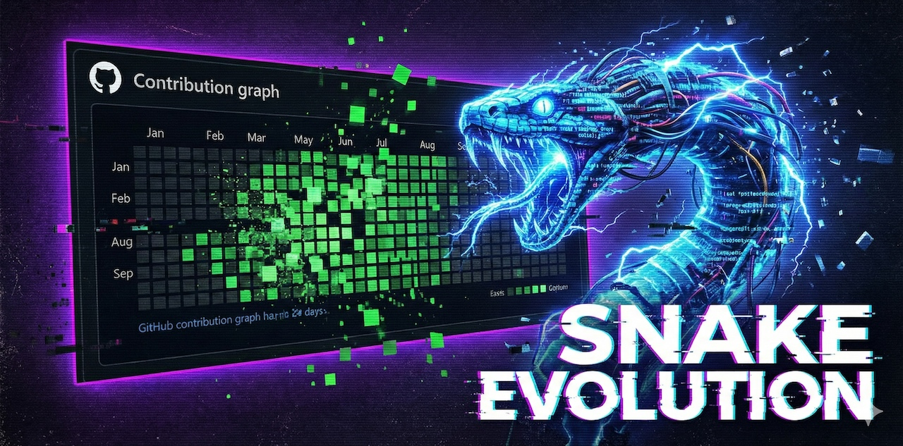

<p align="center">
  
</p>

<p align="center">
  <a href="https://github.com/miccy/snake-evolution/stargazers"></a>
  <a href="https://www.npmjs.com/package/@snake-evolution/cli"></a>
  <a href="https://github.com/miccy/snake-evolution/blob/main/LICENSE"></a>
  <a href="https://github.com/miccy/snake-evolution/actions"></a>
</p>

<p align="center">
  <strong>Turn your GitHub contributions into an animated snake that devours them!</strong>
</p>

<p align="center">
  <picture>
    <source media="(prefers-color-scheme: dark)" srcset="./assets/examples/github-dark.svg">
    <source media="(prefers-color-scheme: light)" srcset="./assets/examples/github-light.svg">
    
  </picture>
</p>

## ✨ Features

- **🎨 6 Beautiful Themes** - Match your profile's aesthetic.
- **🧠 Smart Pathfinding** - Snake hunts high-value contributions first.
- **⚡ Zero-Install** - Run instantly with `bunx` or `npx`.
- **🤖 GitHub Action** - Automated daily updates for your profile.
- **🗓️ Rolling Year** - Always shows the last 12 months of contributions.

## 🚀 Usage

### GitHub Action (Recommended)

Add this workflow to your repository (e.g., `.github/workflows/snake.yml`) to automatically generate the snake animation every day.

```yaml
name: Generate Snake

on:
  schedule:
    - cron: "0 0 * * *" # Run daily at midnight
  workflow_dispatch:        # Allow manual run

jobs:
  build:
    runs-on: ubuntu-latest
    permissions:
      contents: write
    steps:
      - uses: actions/checkout@v4

      - uses: miccy/snake-evolution@v1
        with:
          github_user_name: ${{ github.repository_owner }}
          outputs: |
            dist/snake.svg
            dist/snake-dark.svg?palette=github-dark
            dist/snake-ocean.svg?palette=ocean

      - name: Push to Output Branch
        uses: crazy-max/ghaction-github-pages@v3.1.0
        with:
          target_branch: output
          build_dir: dist
        env:
          GITHUB_TOKEN: ${{ secrets.GITHUB_TOKEN }}
```

### CLI (Zero-Install)

Generate animations locally without installing anything.

```bash
# Using Bun (Recommended)
bunx @snake-evolution/cli@latest generate -u YOUR_USERNAME

# Using npx
npx @snake-evolution/cli@latest generate -u YOUR_USERNAME
```

### Markdown Usage

Add this into your README.md

```markdown
!
```

### HTML in Markdown

Add this into your README.md for centered image with dark/light mode support

```html
<p align="center">
  <picture>
    <source media="(prefers-color-scheme: dark)" srcset="./assets/examples/github-dark.svg">
    <source media="(prefers-color-scheme: light)" srcset="./assets/examples/github-light.svg">
    
  </picture>
</p>
```

## 🎨 Themes

Available themes: `github-dark`, `github-light`, `ocean`, `sunset`, `neon-gamer`, `cypherpunk`.

### 🌑 GitHub Dark (Default)


### ☀️ GitHub Light


### 🌊 Ocean


### 🌅 Sunset


### 🎮 Neon Gamer


### 🔵 Cypherpunk


## 📦 Installation (Global)

If you prefer to have the tool available globally:

```bash
bun add -g @snake-evolution/cli
# or
npm install -g @snake-evolution/cli

# Usage
snake generate -u miccy
```

## 🛠️ Development

This project is a monorepo managed by **Turbo** and **Bun**.

```bash
# Clone repository
git clone https://github.com/miccy/snake-evolution.git
cd snake-evolution

# Install dependencies
bun install

# Build all packages
bun run build

# Run CLI from source
bun run snake generate -u YOUR_USERNAME -o test.svg
```

## 📄 License

Original snake concept by [Platane](https://github.com/Platane) 🙏

---

<div align="center">
  <p>🛠 Maintained by <a href="https://github.com/miccy">@miccy</a> with 💙</p>
  <p>© 2026 <a href="https://github.com/enterprises/ownCTRL">ownCTRL™</a></p>
</div>
